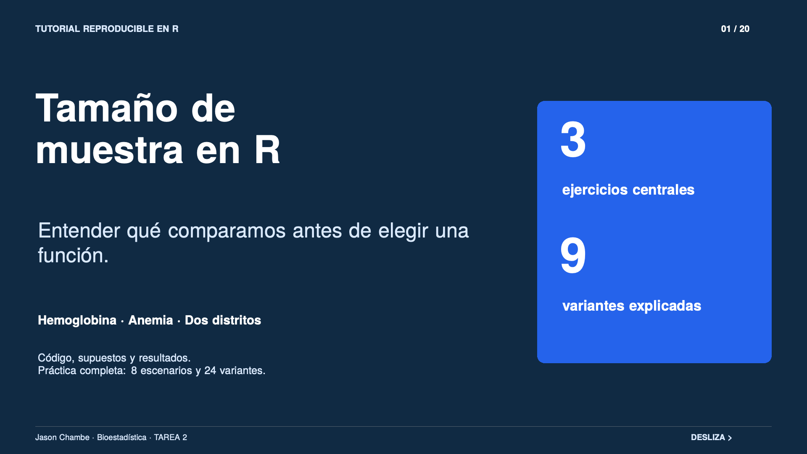

# Tamaño de muestra en R: del diseño a la interpretación

**Jason Chambe · TAREA 2 · Bioestadística**

Un tutorial para entender qué se compara antes de elegir una función de R. Incluye tres ejercicios centrales, nueve variantes resueltas y una práctica ampliada con ocho escenarios y 24 variantes.



## Empieza por aquí

| Material | Archivo |
|---|---|
| Tutorial completo, 33 páginas | [Descargar PDF](tutorial/tutorial_tamano_muestra.pdf) |
| Tutorial editable y ejecutable | [QMD](tutorial/tutorial_tamano_muestra.qmd) · [HTML](tutorial/tutorial_tamano_muestra.html) · [LaTeX](tutorial/tutorial_tamano_muestra.tex) |
| Práctica con preguntas y soluciones desplegables | [QMD](practica/practica_tamano_muestra.qmd) · [HTML](practica/practica_tamano_muestra.html) |
| Carrusel de 20 láminas horizontales | [PDF para compartir](linkedin/carrusel_tamano_muestra.pdf) · [20 PNG, 1920 × 1080](linkedin/imagenes) |
| Publicación de LinkedIn preparada | [Texto](linkedin/texto_post.md) · [PDF con texto e imágenes](linkedin/post_linkedin.pdf) |
| Cálculos reproducibles | [Script de R](codigo/ejercicios.R) · [Resultados CSV](resultados/resultados_verificados.csv) |
| Referencias y revisión | [Fuentes](referencias/fuentes.md) · [Informe de auditoría](auditoria/informe_verificacion.md) |

GitHub muestra el código fuente de los archivos HTML. Para ver el documento con su formato, descarga la carpeta y abre el HTML en tu navegador, o renderiza el QMD en RStudio.

## Los tres ejercicios centrales

| Ejercicio | Pregunta y variantes | Muestra obtenida |
|---|---|---|
| E1. Hemoglobina en Puno | Media contra referencia fija: bilateral, unilateral y menor incremento | 3, 3 y 10 niños |
| E2. Anemia en Juliaca | Proporción contra referencia fija: bilateral, unilateral y menor reducción | 41, 32 y 178 niños |
| E4. Comparación de distritos | Dos proporciones independientes: 80 % de potencia, 90 % y menor diferencia | 121, 162 y 369 por distrito |

Se conservan los identificadores E1, E2 y E4 de la práctica de clase. Los escenarios E3, E5, E6, E7 y E8 desarrollan dos medias independientes, medias pareadas y ANOVA. La práctica también convierte en preguntas los cálculos originales de muestra, potencia y efecto detectable, y construye una curva de potencia.

## Qué significa cada resultado

Los tamaños corresponden a los métodos y supuestos declarados. Alfa es 0,05; potencia es 80 %, salvo las variantes que indican 90 %. En E1 y E2, las referencias de 10 g/dL y 40 % se tratan como fijas. Si se obtuvieran mediciones antes y después en los mismos niños, se necesitaría un planteamiento pareado.

Los métodos de proporciones de `pwr` usan una aproximación basada en arcoseno. Los resultados no incorporan pérdidas, no respuesta ni muestreo por conglomerados. El tamaño de muestra por sí solo no demuestra causalidad ni elimina sesgos.

## Reproducir en RStudio

Descarga el repositorio y abre la carpeta `TAREA2` como directorio de trabajo. Ejecuta una sola vez:

```r
source("codigo/instalar_paquetes.R")
```

Después ejecuta:

```r
source("codigo/ejercicios.R")
```

Este script calcula las 24 variantes, comprueba la potencia con `n` y con `n - 1` y guarda las salidas en `resultados`. Se verificó con R 4.6.1, pwr 1.3-0 y pwr2 1.0. CRAN archivó pwr2 el 27 de mayo de 2026; el script de instalación usa su versión archivada para reproducir la clase.

Abre cualquiera de los dos QMD y pulsa **Render**. También puedes ejecutar, desde `TAREA2`:

```sh
quarto render --to html
```

Los QMD ejecutan sus bloques de R y comprueban los tamaños enteros. Las explicaciones corresponden a las variantes fijas presentadas: si cambias un supuesto, revisa también la redacción y sus comprobaciones.

## Editar y recompilar los PDF

Los archivos `.tex` contienen las fuentes completas. Con una instalación local de LaTeX que incluya `latexmk`, ejecuta desde `TAREA2`:

```sh
latexmk -pdf -outdir=tutorial tutorial/tutorial_tamano_muestra.tex
latexmk -pdf -outdir=linkedin linkedin/carrusel_tamano_muestra.tex
latexmk -pdf -outdir=linkedin linkedin/post_linkedin.tex
```

El carrusel usa páginas de 320 × 180 mm, proporción 16:9. Las imágenes PNG son representaciones de esas mismas páginas a 1920 × 1080 píxeles, sin diferencias de contenido con el PDF. El PDF de la publicación reúne el texto propuesto y las 20 páginas del carrusel; no es una constancia de publicación en LinkedIn.

## Fuentes y autoría

Adaptación didáctica de **Teoría 01, Teoría 02, Teoría 03 y Muestra.qmd**, de Antonio M. Quispe, proporcionados como materiales de clase. Teoría 01 y 02 fundamentan de forma breve el diseño de cada variante; Teoría 03 y el QMD orientan los métodos de cálculo. Se consultó además la documentación oficial de R y los paquetes utilizados.

Los contextos y variantes añadidos son ejercicios de planificación, no resultados de estudios reales. Las precisiones metodológicas se explican en el tutorial. Los PDF originales del profesor no se redistribuyen. Las referencias completas están en [fuentes.md](referencias/fuentes.md).
